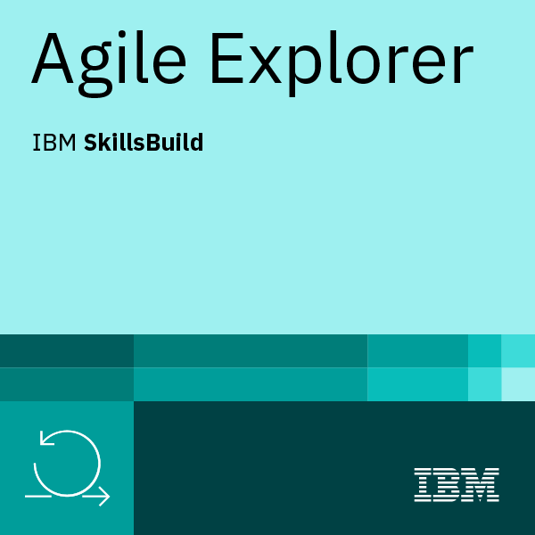

  

 

  
   

   

<h1 align="center">Hi 👋, I'm Amy Spawton</h1>
<h3 align="center">A passionate full-stack developer from Oxfordshire</h3>

 

On any given day you can find me donning two hats: I'm a software engineer by day and a goldsmith by night!

As a software engineer, I build full stack web applications for my clients. I have always had a keen interest in problem solving and creating products from scratch and this combination led me to pursue a career in software engineering.

Once the sun sets, you can find me nursing old and broken jewellery back to life and handing it back over to its grateful owner where it will be loved once more. For every piece of jewellery I rescue, it means one less piece at the landfill. My superpower is converting trash to treasure, what's yours?

- 🔭 I’m currently working on **An intensive 12 week academy with Digital Futures!**
- 🌱 I’m currently learning **Java and Javascript!**
- 👯 I’m looking to collaborate on **any exciting beginner projects with like-minded developers**
- 📫 How to reach me: **amyspawton.com**
- 😄 Pronouns: **She/Her**
- ⚡ Fun fact: **I still haven't watched any of Game of thrones!**

Links to Repos:

### [All Digital Futures Assessed Work](https://github.com/Spawton/Digital-Futures-Challenges)
### [Academy Full Stack Team Engineering Project](https://github.com/SE-2209-Group1)
### [Ongoing pair-programming project](https://github.com/Jacamy)

More Links to my projects below!...

  
  
  

  

  

  
Visitor Count

  

<h1 align="center">Projects</h1>
<table bordercolor="#66b2b2">

  <tr>
      <td width="50%" valign="top">
      <h3 align="center">Chitter Challenge</h3>
         
        
         
        

   
<!--      -->
  </a>
      

        
A lovely full stack application inspired by twitter!

    </td>
    <td width="50%" valign="top">
      <h3 align="center">Portfolio Website</h3>
       
        
       
        

  <a href="#" target="_blank">
<!--      -->
  </a>
  
      

        
My portfolio website

    </td>

  </tr>
  
  <tr>
      <td width="50%" valign="top">
      <h3 align="center">Group DFX Clone</h3>
         
        
         
        

   
<!--      -->
  </a>
      

        
A fantastic full stack application inspired by the DFX website and built alongside a group of amazing developers!

    </td>
    <td width="50%" valign="top">
      <h3 align="center">Pair-Programming Project</h3>
       
        
       
        

  
  <a href="#" target="_blank">
<!--      -->
  </a>
      

        
A snazzy homepage built alongside a fabulous developer friend!

    </td>

  </tr>
  
  <tr>
    <td width="50%" valign="top">
      <h3 align="center">Studio Ghibli film viewer</h3>
         
        
         
        

  
  
      

        
View the wonderful films of Studio Ghibli!

    </td>
    <td width="50%" valign="top">
      <h3 align="center">Naughts and crosses game</h3>
         
        
         
        

  
  
      

        
A fun interactive game of Naughts and Crosses!

    </td>
  </tr>
</table>

<h3 align="left">Connect with me:</h3>

<h3 align="left">Languages and Tools:</h3>

                 

